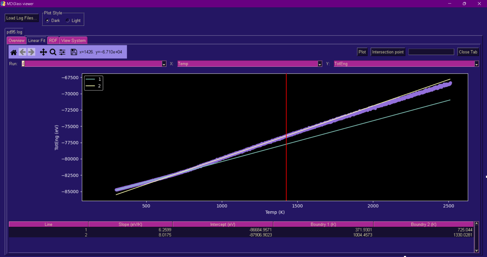
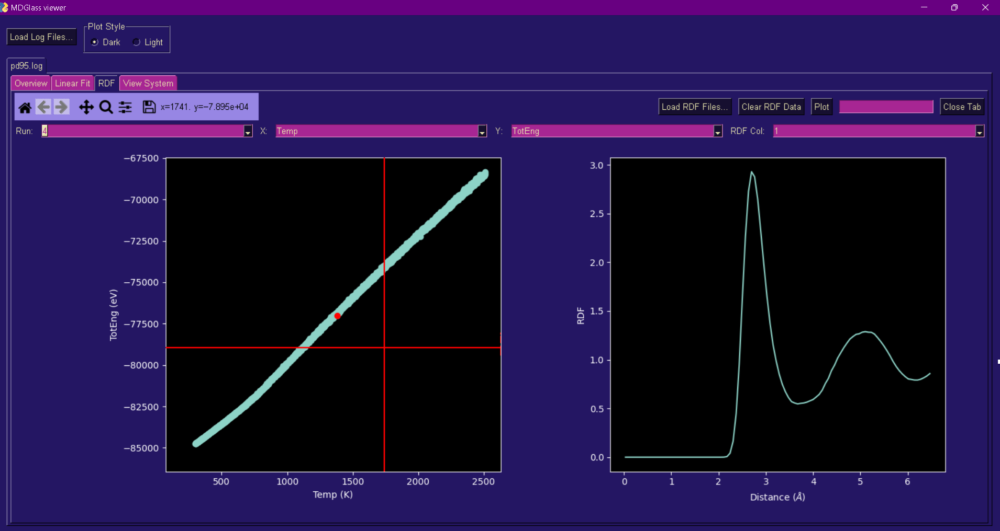

# User Manual

## Introduction
The source code of the MDGlass viewer program is available in the repository located on GitHub at the following link: [MDGlass Viewer Repository](https://github.com/MateuszModz/MDglass-viewer). One of the downloaded files will be `main.ipynb`, which needs to be executed. This requires the IPython shell, available in editors such as Jupyter Notebook [1], Jupyter Lab [1], or VS Code [2] with the Jupyter Notebook extension. The first run may take a while as the program will automatically download missing libraries.

## Main Window
After launching the program, the main window will appear as shown in Figure 1. It offers the option to choose between light and dark mode. Start by clicking on the "[Load Log Files...]" button. This will open the system file explorer allowing you to load a log file. It's possible to load multiple files at once. Due to the necessity of handling errors during file loading, only specific extensions are allowed, such as "log.*", "*.log", "*.out", "*.lammps". This limitation is necessary to prevent accidental loading of non-text files (e.g., "*.gif", "*.exe"). If the loading function fails to load the data correctly, an error notification will pop up indicating which file caused the issue. Navigation between loaded files is done through tabs, named after the file. Each tab has four sub-tabs corresponding to implemented functionalities.

*Figure 1: Main window of the program immediately after launch.*

## Sub-tab "Overview"
The first visible sub-tab upon loading a log file is "Overview". Its main function is to provide a quick overview of the output data. It allows checking whether the simulation is proceeding as expected even during runtime, aiding in early error detection during simulation setup, thus saving time and computational resources. The window with the "Overview" sub-tab open is shown in Figure 2.

*Figure 2: Main window of the program with the "Overview" sub-tab open.*

The "Overview" tab contains a set of four plots that draw default configurations of physical quantities:
- Total energy vs. temperature,
- Temperature vs. time,
- Pressure vs. time,
- Ndanger (a quantity indicating the number of "dangerous" operations according to LAMMPS) vs. time.

If the default physical quantity is not included in the log file, a random plot from available quantities is drawn. All MDGlass viewer plots come with a toolbar containing seven buttons for manipulating the view, layout, and saving the plot as an image. Hovering over the plot displays a text field dynamically showing the mouse coordinates. Below is an explanation of the functionality of these buttons in order from the left:
1. Reset to the default view.
2. Go back to the previous view.
3. Go forward to the next view.
4. Left-click and drag to move the plot, right-click to zoom in or out. Holding down the "x/y" key locks one of the axes. Holding down the "Ctrl" key maintains the aspect ratio while zooming.
5. Zoom to a rectangle drawn with the left mouse button. Right-clicking on the plot zooms out. You can hold the "x/y" key to lock one of the axes.
6. Configure plot positions. Clicking opens a window with sliders and a "Reset" button to restore default settings. The sliders adjust the distance from the edge of the plot to the canvas on which the plot is located. If there's more than one plot on a single canvas, you can adjust the distance between them.
7. Save the plot as an image. Clicking opens the system file explorer to specify the location, name, and extension of the saved image.

Above the plots are corresponding frames with dropdown lists, allowing selection of data for visualization on the plots:
- Run: If the loaded log file contains multiple blocks corresponding to different stages of the simulation, this list allows selection of the stage for which data will be visualized.
- X: Choose from available physical and structural quantities in the log file to be plotted on the x-axis.
- Y: Similar to X, but for selecting data for the y-axis.

After selecting data for visualization using the dropdown lists, click the "[Plot]" button to redraw the plots. There's also a "[Close Tab]" button to close the currently open tab corresponding to a single log file.

## Sub-tab "Linear Fit"
This sub-tab contains elements such as a single plot, a toolbar, a frame with dropdown lists, and buttons "[Plot]" and "[Close Tab]", which were discussed earlier in "Overview" section. The "Linear Fit" sub-tab can be seen in Figure 3.

*Figure 3: Main window of the program with the "Linear Fit" sub-tab open.*

The main functionality of this sub-tab is the ability to perform linear fitting to a selected range of points. An additional interactive element with the plot—a red cursor in the form of a vertical line—assists in defining the fitting range graphically. Users define the fitting range by two single left-clicks on the plot. The order of selection doesn't matter; you can first select the right boundary and then the left one, and vice versa. After these two clicks, the fitted line is drawn on the plot. It is identified in the plot legend by consecutive numbers starting from 1.
All parameters of the fitted lines are displayed in a table below the plot. The columns of this table include:
1. "Line" — the previously mentioned identification number of the line.
2. "Slope" — the slope of the fitted line along with its unit.
3. "Intercept" — the intercept of the line with the y-axis along with its unit.
4. "Boundary 1" — the first boundary of the fitting range along with its unit.
5. "Boundary 2" — the second boundary of the fitting range along with its unit.
It's worth noting that the rows corresponding to the two most recent lines are automatically selected. By left-clicking on a row, it can be selected or deselected. At most, two rows can be selected simultaneously.
The logic of selecting rows allows for choosing two lines, which is important due to the nature of the studied materials—metallic glasses. Finding the glass transition temperature ($T_g$) is desired, which can be achieved by fitting two lines to the plot of total energy versus temperature. The position of the intersection point of lines, whose slopes are proportional to the specific heat above and below $T_g$, is the glass transition temperature. Calculating this intersection point is done by clicking the "[Intersection Point]" button. The glass transition temperature is then displayed in a text field next to the button. A dashed red vertical line appears on the plot (assuming the intersection point is within the plot), visually confirming the correctness of the intersection point determination. If multiple lines are fitted, an error may occur in their selection. You can start over by removing previously fitted lines using the "[Plot]" button to redraw the plot.

## Sub-tab "RDF" (Radial Distribution Function)
This sub-tab contains elements discussed earlier in "Overview": two plots, a toolbar, dropdown lists, and buttons "[Plot]" and "[Close Tab]". The appearance of the tab and its contents can be seen in Figure 4.

*Figure 4: Main window of the program with the "RDF" sub-tab open.*

The functionality of this sub-tab involves interactive visualization of the RDF (Radial Distribution Function). On the left plot, thermodynamic data from the log file is plotted, selected through three dropdown lists: "Run," "X," and "Y."
Hovering over the left plot reveals a red cursor consisting of horizontal and vertical lines. Interaction by clicking is not yet available because the rdf file needs to be loaded first. Multiple files can be loaded at once. It should be noted that if a different file with the same timestep is loaded subsequently, the data will be overwritten. There's an option to clear RDF data by pressing the "[Clear RDF Data]" button.
After loading the RDF data, clicking with the left mouse button on the left plot finds the nearest point to the click location. The program reads the corresponding timestep and finds the closest timestep with the loaded RDF function. A red dot appears on the left plot, and the corresponding pair distribution function is drawn on the right plot. This allows viewing the RDF before and after a phase transition.
The plot contains information about interatomic distances, from which the material phase can be inferred. After drawing the right plot, interactivity similar to the left plot becomes available. By clicking with the left mouse button on the plot, the program finds the nearest point and displays its coordinates in the text field above. This functionality is useful, for example, in finding the interatomic distance corresponding to the peak maximum.
The rdf files may have more than one column, which can be plotted on the y-axis. To choose this column, use the "RDF Col." dropdown list, which numbers the columns from 1, skipping the first two columns containing the bin number and the interatomic distance, respectively. It's up to the user to interpret the data in these columns.

## Sub-tab "View System"
In the "View System" sub-tab, elements discussed earlier in "Overview" are present, such as a plot, a toolbar, dropdown lists for selecting visualized data, and buttons "[Plot]" and "[Close Tab]". The sub-tab can be seen in Figure 5.

*Figure 5: Main window of the program with the "View System" sub-tab open.*

The key functionality is the ability to preview the atom arrangement for a selected timestep. It works similarly to the RDF functionality discussed in Section 2.2. The first step is to load a dump file using the "[Load Dump Files...]" button. Multiple files can be loaded at once. It's important to note that data about atom positions for a given timestep will be overwritten if the timestep is loaded again. You can clear the loaded data by pressing the "[Clear Dump Data]" button.
After successfully loading information about atom positions, click with the left mouse button on the left plot. The program finds the nearest point to the click location, extracts its timestep, and selects the nearest timestep (indicated by a red dot) from the loaded dump data. The atom arrangement is visualized on the right side.
The program allows adjusting the size of the drawn system. Using the "Subbox Center" and "Subbox Size" sliders, you can define the viewed fragment of the simulation box, called the viewing box. This is done by selecting the center point and size. Both values are in percentages, meaning that selecting the center point $(50,50,50)$ indicates the center of the simulation box, and $(100,100,0)$ indicates one of its vertices. The size of the viewing box is a percentage value of the simulation box's sides. Thus, the simulation and viewing boxes are similar rectangular parallelepipeds, and selecting the center $(50,50,50)$ and size $100$ results in drawing the entire simulation box. For relatively large systems (e.g., 20000 atoms), drawing can be slow, which defeats the purpose of the program. Therefore, for systems with more than 5000 atoms, 20% of the simulation box is drawn by default.
It's also possible to set certain parameters related to the appearance of the visualized system. Using the "Rot" sliders, the rotation of the viewing box (in degrees) around the x, y, and z axes can be changed. The atomic radius can be changed using the "Atom Radii" text field, where you enter the selected radius in Angstroms. The software allows only one value for all atom types. The last option is to choose the color of atoms using the "Atom Colors" text field. This is done according to the convention "1:red,2:lightgreen,3:blue," where digits represent atom types from the dump file, followed by a colon and the named color (Python). Color definitions for each atom type are separated by commas.
After selecting the appropriate viewing box and preferred visual settings, the system needs to be redrawn. To do this, press the "[Replot System]" button.

### References
[1] Jupyter Project. (n.d.). Jupyter. Retrieved from https://jupyter.org/
[2] Microsoft. (n.d.). Visual Studio Code. Retrieved from https://code.visualstudio.com/

